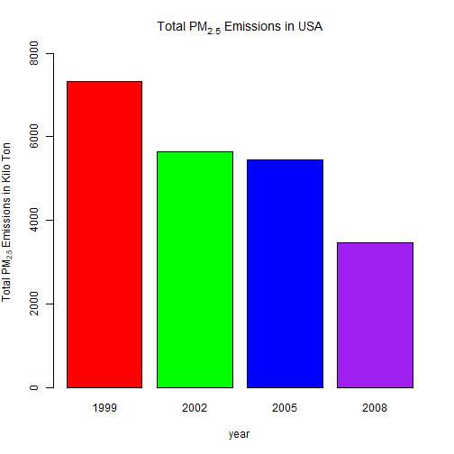
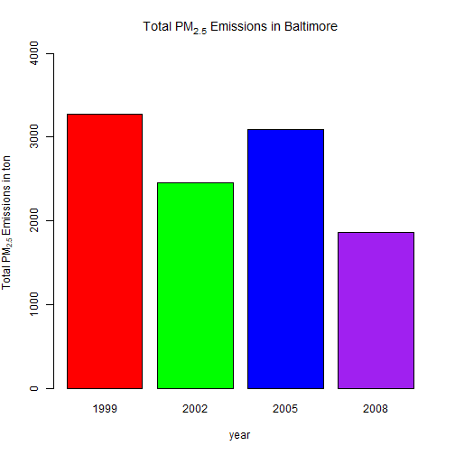
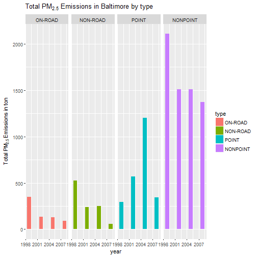
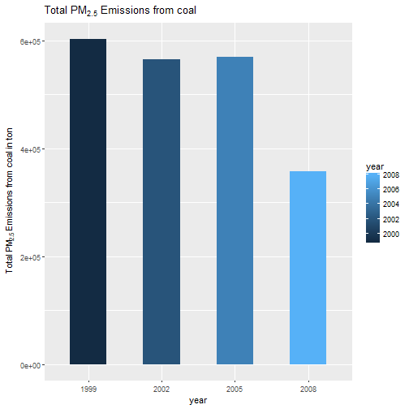
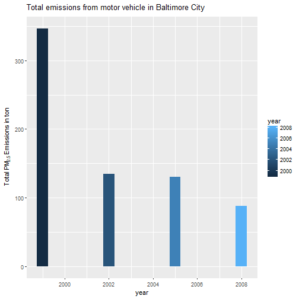
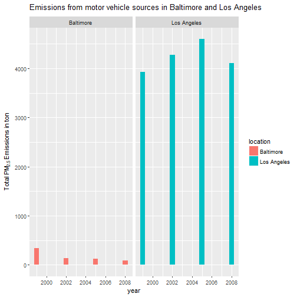

# Exploratory Data Analysis Project 2


## Instructions

Fine particulate matter (PM2.5) is an ambient air pollutant for which there is strong evidence that it is harmful to human health. In the United States, the Environmental Protection Agency (EPA) is tasked with setting national ambient air quality standards for fine PM and for tracking the emissions of this pollutant into the atmosphere. Approximatly every 3 years, the EPA releases its database on emissions of PM2.5. This database is known as the National Emissions Inventory (NEI). You can read more information about the NEI at the EPA National Emissions Inventory web site.

For each year and for each type of PM source, the NEI records how many tons of PM2.5 were emitted from that source over the course of the entire year. The data that you will use for this assignment are for 1999, 2002, 2005, and 2008.

Data
The data for this assignment are available from the course web site as a single zip file:

Data for Peer Assessment [29Mb] The zip file contains two files:

PM2.5 Emissions Data (summarySCC_PM25.rds): This file contains a data frame with all of the PM2.5 emissions data for 1999, 2002, 2005, and 2008. For each year, the table contains number of tons of PM2.5 emitted from a specific type of source for the entire year. Here are the first few rows.

  fips      SCC Pollutant Emissions  type year
 09001 10100401  PM25-PRI    15.714 POINT 1999
 09001 10100404  PM25-PRI   234.178 POINT 1999
 09001 10100501  PM25-PRI     0.128 POINT 1999
 09001 10200401  PM25-PRI     2.036 POINT 1999
 09001 10200504  PM25-PRI     0.388 POINT 1999
 09001 10200602  PM25-PRI     1.490 POINT 1999
 
fips: A five-digit number (represented as a string) indicating the U.S. county

SCC: The name of the source as indicated by a digit string (see source code classification table)

Pollutant: A string indicating the pollutant

Emissions: Amount of PM2.5 emitted, in tons

type: The type of source (point, non-point, on-road, or non-road)

year: The year of emissions recorded

Source Classification Code Table (Source_Classification_Code.rds): This table provides a mapping from the SCC digit strings in the Emissions table to the actual name of the PM2.5 source. The sources are categorized in a few different ways from more general to more specific and you may choose to explore whatever categories you think are most useful. For example, source "10100101" is known as "Ext Comb /Electric Gen /Anthracite Coal /Pulverized Coal".

You can read each of the two files using the readRDS() function in R. For example, reading in each file can be done with the following code:
NEI <- readRDS("summarySCC_PM25.rds")

SCC <- readRDS("Source_Classification_Code.rds")

as long as each of those files is in your current working directory (check by calling dir() and see if those files are in the listing).


## Files included in this project

1. plot1.r to plot6.r: R script to analysis the data and make plots
2. plot1.png to plot6.png: plots 

## Question 1
## 1.Have total emissions from PM2.5 decreased in the United States from 1999 to 2008? Using the base plotting system, make a plot showing the total PM2.5 emission from all sources for each of the years 1999, 2002, 2005, and 2008.


```r
library(dplyr)
```

```
## Warning: package 'dplyr' was built under R version 3.3.3
```

```
## 
## Attaching package: 'dplyr'
```

```
## The following objects are masked from 'package:stats':
## 
##     filter, lag
```

```
## The following objects are masked from 'package:base':
## 
##     intersect, setdiff, setequal, union
```

```r
library(ggplot2)
```

```
## Warning: package 'ggplot2' was built under R version 3.3.3
```

```r
NEI <- readRDS("summarySCC_PM25.rds")
SCC <- readRDS("Source_Classification_Code.rds")

emissionByYear <- summarise(group_by(NEI, year), totalEmissions = sum(Emissions))

with(emissionByYear, barplot(totalEmissions/1000.0, names =year,
                            xlab = "year", 
                            ylab = expression("Total PM"[2.5]*" Emissions in Kilo Ton"),
                            ylim = c(0,8000),
                            main = expression("Total PM"[2.5]*" Emissions in USA"), 
                            col= c("red", "green", "blue", "purple")))
```



## Question 2
## 2. Have total emissions from PM2.5 decreased in the Baltimore City, Maryland (fips == "24510") from 1999 to 2008? Use the base plotting system to make a plot answering this question.

```r
baltimore <- summarise(group_by(subset(NEI, fips == "24510"), year), totalEmissions = sum(Emissions))

with(baltimore, barplot(totalEmissions, 
                            names = year,
                            xlab  = "year", 
                            ylab  = expression("Total PM"[2.5]*" Emissions in ton"),
                            ylim  = c(0,4000),
                            main  = expression("Total PM"[2.5]*" Emissions in Baltimore"), 
                            col   = c("red", "green", "blue", "purple")))
```



## Question 3
## 3. Of the four types of sources indicated by the type (point, nonpoint, onroad, nonroad) variable, which of these four sources have seen decreases in emissions from 1999-2008 for Baltimore City? Which have seen increases in emissions from 1999-2008? Use the ggplot2 plotting system to make a plot answer this question.

```r
baltimore <- summarise(group_by(subset(NEI, fips == "24510"), type, year), totalEmission = sum(Emissions))
baltimore$type <- factor(baltimore$type, levels=c("ON-ROAD", "NON-ROAD", "POINT", "NONPOINT"))  

g <- ggplot(baltimore, aes(x = year, y = totalEmission, fill = type))
g <- g + geom_bar(position="dodge", stat = "identity", width = 1.0) + facet_grid(.~type) 
g <- g + ggtitle(expression("Total PM"[2.5]*" Emissions in Baltimore by type")) 
g <- g + labs(x = "year") + labs(y = expression("Total PM"[2.5]*" Emissions in ton"))

print(g)
```



## Question 4
## 4. Across the United States, how have emissions from coal combustion-related sources changed from 1999-2008?


```r
coalSCC = SCC[grepl("coal", SCC$Short.Name, ignore.case=TRUE), "SCC"]
coalNEI <- NEI[NEI$SCC %in% coalSCC, ]

coalEmission <- summarise(group_by(coalNEI, year), totalEmissions = sum(Emissions))

g <- ggplot(coalEmission, aes(x = factor(year), y = totalEmissions, fill = year))
g <- g + geom_bar(position="dodge", stat = "identity", width = 0.5) 
g <- g + ggtitle(expression("Total PM"[2.5]*" Emissions from coal")) 
g <- g + labs(x = "year") + labs(y = expression("Total PM"[2.5]*" Emissions from coal in ton"))

print(g)
```


## Question 5
## 5. How have emissions from motor vehicle sources changed from 1999-2008 in Baltimore City?


```r
motorVehicle  <- summarise(group_by(subset(NEI, fips == "24510" & type == 'ON-ROAD'), year), totalEmissions = sum(Emissions))

g <- ggplot(motorVehicle, aes(x = year, y = totalEmissions, fill = year))
g <- g + geom_bar(position="dodge", stat = "identity", width = 0.5) 
g <- g + ggtitle(expression("Total emissions from motor vehicle in Baltimore City")) 
g <- g + labs(x = "year") + labs(y = expression("Total PM"[2.5]*" Emissions in ton"))

print(g)
```


## Question 6
## 6. How have emissions from motor vehicle sources changed from 1999-2008 in Baltimore City?


```r
baltimore  <- summarise(group_by(subset(NEI, fips == "24510" & type == 'ON-ROAD'), year), totalEmissions = sum(Emissions))
baltimore$location <- "Baltimore"

LosAngeles <- summarise(group_by(subset(NEI, fips == "06037" & type == 'ON-ROAD'), year), totalEmissions = sum(Emissions))
LosAngeles$location <- "Los Angeles"

emissionData <- rbind(baltimore, LosAngeles)

g <- ggplot(emissionData, aes(x = year, y = totalEmissions, fill = location))
g <- g + facet_grid(.~location) 
g <- g + geom_bar(position="dodge", stat = "identity", width = 0.5) 
g <- g + ggtitle(expression("Emissions from motor vehicle sources in Baltimore and Los Angeles")) 
g <- g + labs(x = "year") + labs(y = expression("Total PM"[2.5]*" Emissions in ton")) 
 
print(g)
```


